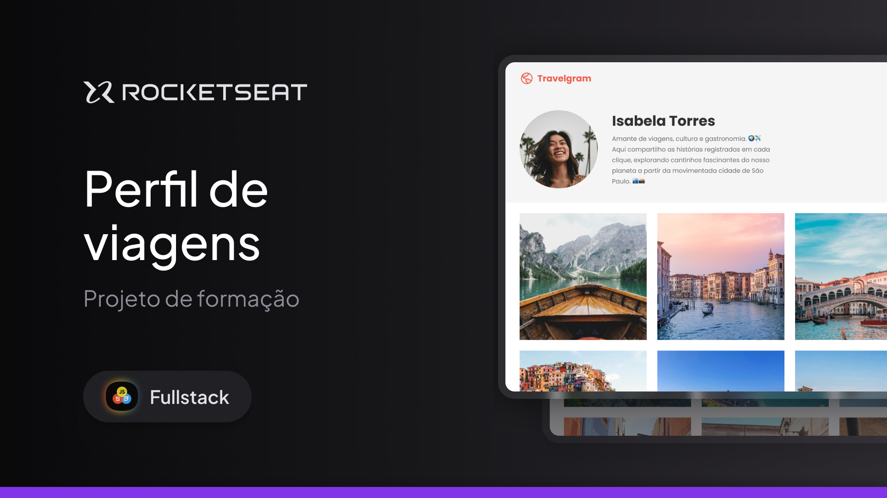

<h1 align="center"> Travelgram </h1>

  <a href="#-projeto">Projeto</a>&nbsp;&nbsp;&nbsp;|&nbsp;&nbsp;&nbsp;
  <a href="#-tecnologias">Tecnologias</a>&nbsp;&nbsp;&nbsp;|&nbsp;&nbsp;&nbsp;
  <a href="#memo-licença">Licença</a>

  

 

  

## 💻 Projeto

Site com uma ideia de perfil de viagens de uma rede social, com exposição de fotos.

- [Acesse o projeto finalizado, online](https://viniciogomesr.github.io/projeto-travelgram/)

## 🚀 Tecnologias

Esse projeto foi desenvolvido com as seguintes tecnologias:

- HTML e CSS
- Git e Github

## :memo: Licença

Esse projeto está sob a licença MIT.

---